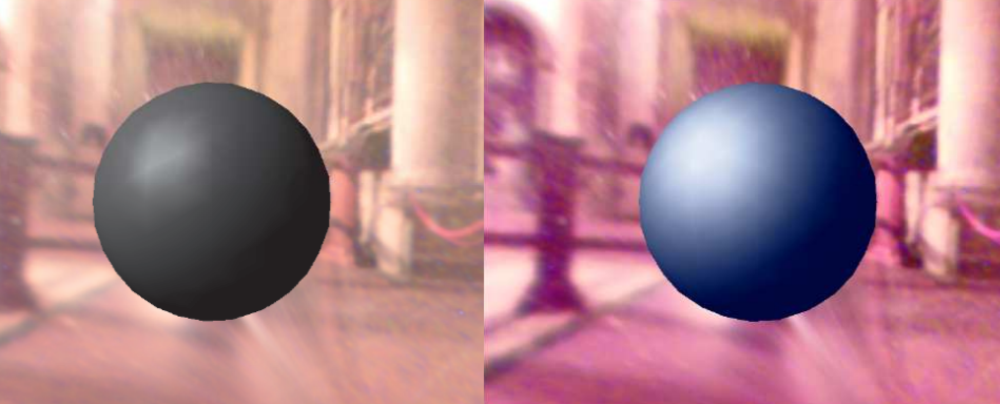
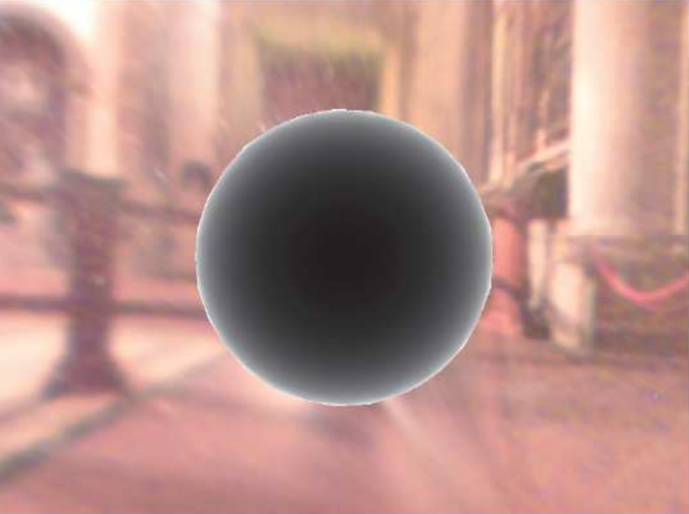

1. Ile bajtów zajmuje typ 'float3' w HLSL
- [ ] 3
- [ ] 12
- [ ] 9

<details>
<summary>Odpowiedź</summary>

> - [x] 12

</details>

---

2. Co to jest dyspersja chromatyczna?
- [ ] udział składnika zwieciadlanego w końcowym [...]
- [ ] kodownanie nierówności powierzchni w teksturze [...]
- [ ] zależność współczynnika załamania światła od długości jego fali

<details>
<summary>Odpowiedź</summary>

> - [x] zależność współczynnika załamania światła od długości jego fali

</details>

---

3. Które z poniższych etapów należą do trójwymiarowych [...]
- [ ] postprocessing
- [ ] przejście(?) materiałów
- [ ] wypełnianie bufora głębokości
- [ ] etap oświetlenia

<details>
<summary>Odpowiedź</summary>

> - [x] przejście(?) materiałów
> - [x] wypełnianie bufora głębokości

</details>

---

4. Od jakich czynników zależy końcowy kolor w oświetleniu Lamberta?
- [ ] wektora patrzenia
- [ ] współczynnika materiału obiektu dla składnika diffuse
- [ ] współczynnika materiału obiektu dla składnika specular
- [ ] wektora padania światła

<details>
<summary>Odpowiedź</summary>

> - [x] współczynnika materiału obiektu dla składnika diffuse
> - [x] wektora padania światła


</details>

---

5. Poniższy rysunek pokazuje efekty obliczeń dwóch modeli oświetlenia dla identycznych parametrów $I_gk_g$ oraz $n$. Jakie to są modele?



- [ ] po lewej stronie jest model Phonga-Blinna, a po prawej Phonga
- [ ] po lewej stronie jest model Phonga, a po prawej Phonga-Blinna
- [ ] nie da się tego określić mając tylko te dane

<details>
<summary>Odpowiedź</summary>

*TO CHECK*
> - [x] po lewej stronie jest model Phonga, a po prawej Phonga-Blinna

</details>

---

6. Jaki model oświetlenia pokazuje poniższy rysunek? [jedna kulka]



- [ ] ramp
- [ ] rim
- [ ] powierzchnia zwierciadlana


<details>
<summary>Odpowiedź</summary>

> - [x] rim

</details>

---

7. Czym cechuje się oświetlenie obliczane w wierzchołkach?
- [ ] jest szybsze niż obliczane w pikselach
- [ ] bardziej obciąża vertex shader niż piksel shader
- [ ] wygładza krawędzie obiektów
- [ ] daje lepszą jakość obrazu niż obliczona w pikselach


<details>
<summary>Odpowiedź</summary>

*TO CHECK*
> - [x] jest szybsze niż obliczane w pikselach
> - [x] bardziej obciąża vertex shader niż piksel shader

</details>

---

8. Wzór $i = I_dk_d cos(N, L) + I_sk_s cos^n(R, V):$
- [ ] przedstawia model oświetlenia Phonga
- [ ] wymaga informacji o położeniu obserwatora
- [ ] jest mniej wymagający obliczeniowo, niż model używający wektora połówkowego
- [ ] zawiera model oświetlenia Lamberta

<details>
<summary>Odpowiedź</summary>

> - [x] przedstawia model oświetlenia Phonga
> - [x] wymaga informacji o położeniu obserwatora
> - [x] zawiera model oświetlenia Lamberta

</details>

---

9. Jaka funkcja HLSL jest potrzebna do zaprogramowania materiału zwierciadlanego?
- [ ] refract
- [ ] reflect
- [ ] transpose


<details>
<summary>Odpowiedź</summary>

> - [x] reflect

</details>

---

10. Między jakimi etapami potoku renderingu znajduje się Geometry Shader?

<details>
<summary>Odpowiedź</summary>

> Vertex Shader i Rasterize Stage

</details>

---

11. Jakiego przekształcenia jest ta macierz?

```math
\begin{bmatrix}
	s\ 0\ 0\\
	0\ s\ 0\\
	0\ 0\ 1
\end{bmatrix}
```

- [ ] translacja
- [ ] rotacja
- [ ] skalowanie  

<details>
<summary>Odpowiedź</summary>

> skalowanie

</details>