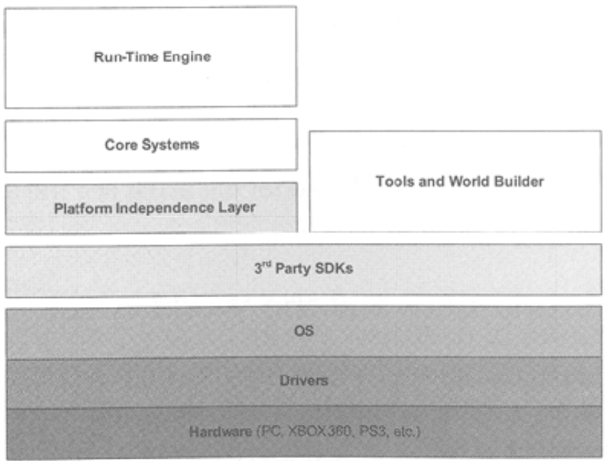
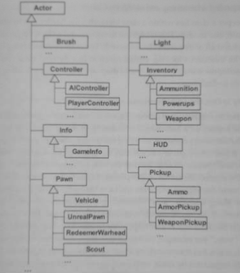

1. Dla którego z poniższych podsystemów odpowiednia jest częstotliwość aktualizacji równa 2 Hz?
- [ ] fizyka
- [ ] sztuczna inteligencja
- [ ] rendering i animacja

Odpowiedź

> Sztuczna inteligencja

---

2. Jaki typ ogólnej architektury pokazuje poniższy rysunek?

Odpowiedź

> Architektura samodzielna

---

3. Które z poniższych cech charakteryzują Resource Manager? [pytanie wielokrotnego wyboru]
- [ ] obsługa mediów charakterystycznych dla konsol
- [ ] zarządzanie zasobami gracza (inventory)
- [ ] obsługa wieloplatformowości silnika

Odpowiedź

*TO CHECK*
> - [x] obsługa wieloplatformowości silnika

---

4. Które z poniższych określeń powinno być użyte do scharakteryzowania silnika gry Pacman?
- [ ] nie może być użyty do zbudowania innej gry
- [ ] może być modyfikowany, żeby zbudować dowolną grę tego typu
- [ ] może być użyty do zbudowania zupełnie dowolnej gry

Odpowiedź

*TO CHECK*
> nie może być użyty do zbudowania innej gry

---

5. Jaki typ architektury game objectu pokazuje poniższy rysunek?

??

---

6. Wadą którego z poniższych rozwiązań obliczania dt (delta time) jest bardzo duży wpływ czasu wykonania poprzedniej ramki mogący doprowadzić do oczekiwania z powodu zależności między podsystemami(?)
- [ ] Δt obliczane jako średnia z kilku poprzednich wartości
- [ ] Δt obliczane na bazie ostatniej ramki
- [ ] stałe Δt

Odpowiedź

*TO CHECK*
> Δt obliczane na bazie ostatniej ramki

---

7. Które z poniższych warst silnika gry znajdują się między Platform Independence Layer a Low-Level Renderer?
- [ ] Resources
- [ ] Drivers
- [ ] Front-End

Odpowiedź

*TO CHECK*
> Resources

---

[mocno niewyraźne]
8. Na czym polega strumieniowanie świata podczas ładowania(?) ??? ???:
- [ ] użycie kilku obszarów pamięci, które mogą przechowywać dane całego chunka
- [ ] użycie ??? małego ????
- [ ] jednoczesne(?) ????

Odpowiedź

> jeżeli chodzi ogólnie o strumieniowanie, to użycie małego obszaru pamięci w porównaniu do całościowego rozmiaru pliku (rezerwacja pamięci tylko na ułamek swojej wielkości)
>
> Z prezentacji (7):
> Ładowanie danych świata:
> - ładowanie proste - z użyciem ekranów ładowania
> - użycie *air lock* - bardzo małe chunki świata, które zajmują gracza na czas ładowania dużego chunka
> - strumieniowanie świata - użycie kilku obszarów pamięci, które mogą przechowywać dane całego chunka

---

9. Jak nazywa się separacja core silnika od assetów?
- [ ] data-driven architecture
- [ ] entity-component system
- [ ] pure component model

Odpowiedź

*TO CHECK*
> data-driven architecture

---

10. Jak można scharakteryzować użycie checkpointów jako metody zapisu stanu gry?
- [ ] wymaga bardzo dużej ilości danych w pliku save
- [ ] niewygodna dla gracza
- [ ] trudne w implementacji przez programistę

Odpowiedź

> niewygodna dla gracza

---

11. Działanie której z wymienionych podzielonych pętli gry pokazuje poniższy rysunek?

        [Main]    [Animation]   [Dynamics]  [Rendering]

Odpowiedź

> 

---

12. Które z poniższych cech są wspólne dla wszystkich silników gier? [pytanie wielokrotnego wyboru]
- [ ] rendering 3D dla gier 3D
- [ ] wysokiej jakości animacje szerokiego broni gracza
- [ ] dokładna detekcja kolizji
- [ ] HID

Odpowiedź

> - [x] rendering 3D dla gier 3D
> - [x] HID

---

13. Co prezentuje poniższy schemat:

- [ ] architektura czysto komponentowa
- [ ] architektura używająca kompozycji
- [ ] architektora używająca uogólnionych komponentów
- [ ] monolityczna hierarchia klas

Odpowiedź

> monolityczna hierarchia klas

---

